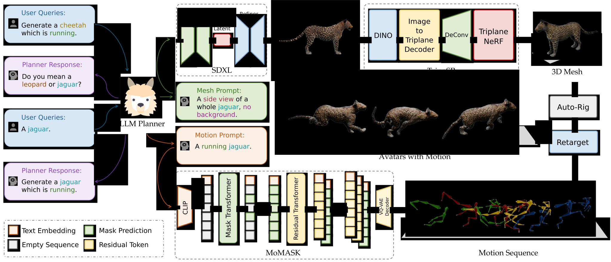

<div align="center"><h1> Motion Avatar: Generate Human and Animal Avatars with Arbitrary Motion <br>
  <!-- <sub><sup><a href="https://miua2024.github.io/">MIUA 2024</a></sup></sub>  -->
</h1>

[Zeyu Zhang](https://steve-zeyu-zhang.github.io)<sup>\*</sup>, [Yiran Wang](https://github.com/u7079256)<sup>\*</sup>, [Biao Wu](https://scholar.google.com/citations?user=Y3SBBWMAAAAJ&hl=en)<sup>\*</sup>, [Shuo Chen](https://www.linkedin.com/in/shuo-chen-7747a7246/), [Zhiyuan Zhang](https://github.com/Tiooo111), [Shiya Huang](https://github.com/gekelly), [Wenbo Zhang](https://zwbx.github.io/), [Meng Fang](https://mengf1.github.io/), [Ling Chen](https://profiles.uts.edu.au/Ling.Chen), [Yang Zhao](https://yangyangkiki.github.io/)<sup>✉</sup>

<sup>*</sup>Equal contribution
<sup>✉</sup>Corresponding author: y.zhao2@latrobe.edu.au

[](https://steve-zeyu-zhang.github.io/MotionAvatar/) [](https://arxiv.org/abs/2405.11286) [](https://paperswithcode.com/paper/motion-avatar-generate-human-and-animal) [](https://steve-zeyu-zhang.github.io/MotionAvatar/static/scholar.html)

</div>

_In recent years, there has been significant interest in creating 3D avatars and motions,
driven by their diverse applications in areas like film-making, video games, AR/VR, and
human-robot interaction. However, current efforts primarily concentrate on either generating the 3D avatar mesh alone or producing motion sequences, with integrating these
two aspects proving to be a persistent challenge. Additionally, while avatar and motion
generation predominantly target humans, extending these techniques to animals remains
a significant challenge due to inadequate training data and methods. To bridge these gaps,
our paper presents three key contributions. Firstly, we proposed a novel agent-based approach named <b>Motion Avatar</b>, which allows for the automatic generation of high-quality
customizable human and animal avatars with motions through text queries. The method
significantly advanced the progress in dynamic 3D character generation. Secondly, we
introduced a <b>LLM planner</b> that coordinates both motion and avatar generation, which
transforms a discriminative planning into a customizable Q&A fashion. Lastly, we presented an animal motion dataset named <b>Zoo-300K</b>, comprising approximately <b>300,000</b>
text-motion pairs across <b>65</b> animal categories and its building pipeline <b>ZooGen</b>, which
serves as a valuable resource for the community._



## News

<b>(05/23/2024)</b> &#127881; Our paper has been promoted by <a href="https://twitter.com/ai_bites/status/1792907754727744000"><b>AI Bites</b></a>!<br>
<b>(05/22/2024)</b> &#127881; Our paper has been promoted by <a href="https://www.reddit.com/r/languagemodeldigest/comments/1cxqebo/create_3d_avatars_with_text_prompts_with_this_new/"><b>Language Model Digest</b></a>!<br>
<b>(05/21/2024)</b> &#127881; Our paper has been promoted by <a href="https://x.com/CSVisionPapers/status/1792975365842817444"><b>CSVisionPapers</b></a>!


## Citation

```
@article{zhang2024motion,
  title={Motion Avatar: Generate Human and Animal Avatars with Arbitrary Motion},
  author={Zhang, Zeyu and Wang, Yiran and Wu, Biao and Chen, Shuo and Zhang, Zhiyuan and Huang, Shiya and Zhang, Wenbo and Fang, Meng and Chen, Ling and Zhao, Yang},
  journal={arXiv preprint arXiv:2405.11286},
  year={2024}
}
```
